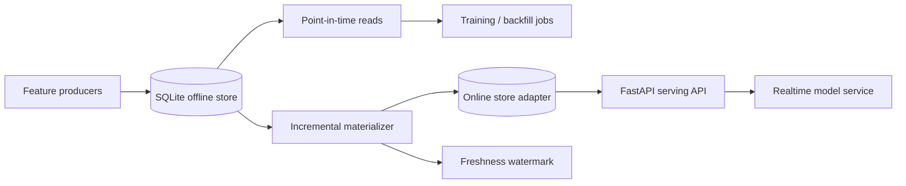

# Feature Store Service

A small but complete **offline/online feature platform** focused on the failure mode that matters most in ML systems: **training/serving skew and point-in-time leakage**.

The project started as an in-memory reference implementation and now includes a durable offline store, low-latency online serving, incremental materialization, freshness tracking, REST APIs, Docker packaging, tests and CI.

## Architecture



## Why this exists

Feature engineering code is easy to demo in a notebook. The production problem is making sure a model sees **the same feature definitions at training time and inference time without leaking future information**.

This repository demonstrates:

- point-in-time correct offline retrieval;
- persistent event-time feature rows;
- latest-value online materialization;
- incremental watermarks;
- freshness/lag reporting;
- idempotent feature writes for the same entity and event timestamp;
- a storage abstraction that can later be replaced by PostgreSQL/BigQuery/S3/Redis;
- REST serving boundaries;
- Docker and CI.

## API

Run locally:

```bash
pip install -e '.[dev]'
uvicorn app.api:app --reload
```

Write a feature row:

```bash
curl -X POST http://localhost:8000/features \
  -H 'content-type: application/json' \
  -d '{
    "entity_id": "customer-42",
    "event_time": "2026-02-01T12:00:00Z",
    "values": {"txn_30d": 15, "avg_amount": 91.2, "risk_score": 0.71}
  }'
```

Read **as of** a historical timestamp:

```bash
curl 'http://localhost:8000/offline/customer-42?as_of=2026-02-01T12:30:00Z'
```

Materialize new rows into the online store:

```bash
curl -X POST 'http://localhost:8000/materialize?limit=1000'
```

Inspect serving freshness:

```bash
curl http://localhost:8000/freshness
```

## Point-in-time correctness

Suppose a customer has feature snapshots at `10:00` and `14:00`. A training example whose label time is `12:00` must retrieve the `10:00` snapshot. Returning the `14:00` row would leak future information and artificially improve offline metrics.

The offline adapter therefore executes the conceptual query:

```sql
SELECT *
FROM feature_rows
WHERE entity_id = :entity
  AND event_time <= :label_time
ORDER BY event_time DESC
LIMIT 1;
```

The behavior is covered by tests.

## Repository layout

```text
feature-store-lab/
├── app/
│   └── api.py
├── storage/
│   └── sqlite_store.py
├── tests/
│   └── test_service.py
├── feature_store.py
├── Dockerfile
├── pyproject.toml
└── .github/workflows/ci.yml
```

## Production evolution

The public project intentionally uses SQLite and an in-process online store so it is runnable anywhere. The same interfaces map naturally to:

| Concern | Local implementation | Production direction |
|---|---|---|
| Offline store | SQLite | S3/Parquet, BigQuery, Snowflake, PostgreSQL |
| Online store | in-memory adapter | Redis / DynamoDB |
| Orchestration | HTTP materialization call | Airflow / Dagster / scheduled job |
| Freshness | watermark table | metrics + alerting |
| Feature definitions | Python structures | registry / declarative feature specs |
| Serving | FastAPI | Kubernetes / ECS / Cloud Run |

## Interview topics demonstrated

`point-in-time joins` · `training-serving skew` · `event time` · `materialization` · `online/offline stores` · `feature freshness` · `idempotency` · `data leakage` · `ML platform design`

The goal is not to imitate Feast line-for-line; it is to make the core architecture small enough to inspect and explain end to end.
