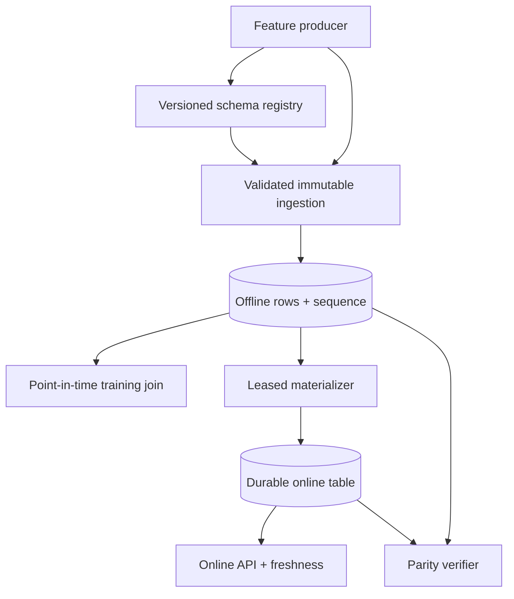

# Feature Platform Control Plane

A runnable feature platform that treats data correctness as a set of enforced invariants—not a diagram. It provides versioned feature schemas, immutable/idempotent ingestion, leakage-safe training joins, durable online serving, transactional materialization, freshness policy and online/offline parity checks.

The repository began as a small offline/online store. The current implementation is a package with explicit domain, application, persistence and HTTP boundaries backed by 18 regression tests and three CI jobs.

## What can go wrong

The original materializer used an event-time watermark:

```sql
WHERE event_time > :watermark
ORDER BY event_time
LIMIT :batch_size
```

If three rows had the same event timestamp and the batch size was two, the watermark advanced to that timestamp and the third row was never read. The current implementation checkpoints a monotonic ingestion sequence and commits online writes and the cursor in one SQLite transaction.

| Invariant | Enforcement |
|---|---|
| No future leakage | `event_time <= label_time` point-in-time lookup |
| No backfill leakage | Optional `created_at <= dataset_cutoff` constraint |
| No silent mutation | Immutable logical key plus content hash |
| Safe retries | Stable ingestion ID returns the original row |
| No batch-boundary loss | Monotonic sequence cursor, independent of event time |
| No online rollback | Compare-and-set on event time, then sequence |
| One active materializer | Expiring owner lease |
| Training/serving consistency | Online/offline row-sequence and value parity |
| Explicit stale data | Per-view TTL and serving age metadata |

## Architecture



The local adapter deliberately uses SQLite so every invariant is runnable without cloud credentials. In production the same boundaries map to a warehouse/lakehouse for historical rows, Redis or DynamoDB for online serving, and a scheduled worker for materialization.

## Domain model

- `FeatureView` is an immutable, fingerprinted schema version.
- `FeatureDefinition` declares name, scalar type, nullability and documentation.
- `FeatureRow` carries event time, ingestion time, logical identity and content hash.
- `TrainingExample` preserves label time and the exact source row sequence.
- `OnlineFeature` returns values together with age and stale status.

Compatible schema evolution may add nullable features. Removing a feature, changing its type, changing the entity type or adding a required field is rejected. A version already registered under the same name cannot be mutated.

## API walkthrough

Install and run:

```bash
pip install -e '.[dev]'
uvicorn app.api:app --reload
```

Register a feature view:

```bash
curl -X POST http://localhost:8000/v1/views \
  -H 'content-type: application/json' \
  -d '{
    "name": "customer_risk",
    "version": 1,
    "entity_type": "customer",
    "ttl_seconds": 3600,
    "features": [
      {"name": "txn_30d", "dtype": "integer"},
      {"name": "avg_amount", "dtype": "float"},
      {"name": "segment", "dtype": "string", "nullable": true}
    ]
  }'
```

Ingest an immutable row:

```bash
curl -X POST http://localhost:8000/v1/features \
  -H 'content-type: application/json' \
  -d '{
    "view_name": "customer_risk",
    "entity_id": "customer-42",
    "event_time": "2026-02-01T12:00:00Z",
    "ingestion_id": "warehouse-event-8841",
    "values": {"txn_30d": 15, "avg_amount": 91.2}
  }'
```

Build a training set. Missing entities are explicit rather than silently dropped:

```bash
curl -X POST http://localhost:8000/v1/training-set \
  -H 'content-type: application/json' \
  -d '{
    "view_name": "customer_risk",
    "created_before": "2026-03-01T00:00:00Z",
    "examples": [
      {"entity_id": "customer-42", "label_time": "2026-02-02T00:00:00Z"}
    ]
  }'
```

Materialize and verify parity:

```bash
curl -X POST 'http://localhost:8000/v1/materializations/online?owner=worker-a&limit=1000'
curl http://localhost:8000/v1/online/customer_risk/customer-42
curl http://localhost:8000/v1/parity/customer_risk/customer-42
```

## Failure semantics

Write retries are safe only when they represent the same content. Reusing an ingestion ID or logical `(view, version, entity, event_time)` key with a different payload returns a typed `409 FeatureMutationError`. Corrections must use a new event time or an explicitly designed correction workflow; the storage layer never silently rewrites training history.

The materializer acquires a renewable job lease inside `BEGIN IMMEDIATE`, scans rows by sequence, performs online compare-and-set writes, advances the cursor and releases the lease in one commit. A live lease owned by another worker returns `MaterializationLeaseError`. An expired lease can be recovered.

## Evidence and verification

```bash
ruff check .
ruff format --check .
pytest -q
feature-platform-evidence > reference-run.json
docker build -t feature-platform .
```

CI independently verifies:

1. lint, format, 18 behavioral tests and a JSON evidence artifact;
2. wheel build plus installation into a clean virtual environment;
3. multi-stage non-root container build plus a live health probe.

The evidence command executes real registry, ingestion, two-batch materialization, point-in-time join and parity operations. Its booleans are computed from the run; they are not hard-coded benchmark claims.

## Repository layout

```text
feature_platform/
├── errors.py       typed domain failures
├── evidence.py     deterministic end-to-end evidence run
├── models.py       schemas, rows and compatibility rules
├── service.py      application boundary
└── store.py        SQLite registry, offline/online store and materializer
app/api.py          FastAPI app factory and v1 transport
tests/              registry, ingestion, PIT, materialization and API tests
feature_store.py    compatibility layer for the original public API
```

## Honest production boundary

This repository proves feature-store semantics on one transactional database. It does not claim distributed warehouse-to-Redis atomicity. A production split-store design would use an outbox or CDC stream, consumer idempotency, warehouse partitioning, Redis Lua/CAS writes, reconciliation jobs, access control and per-view SLIs. Those concerns are named here to make the scaling boundary explicit, not presented as already implemented.

## Interview surface

`feature stores` · `point-in-time joins` · `event time vs ingestion time` · `schema evolution` · `training-serving skew` · `idempotency` · `leases` · `transactional checkpoints` · `late data` · `freshness SLOs` · `model platform APIs`


## Numeric feature drift audit

The dependency-free PSI audit in `feature_platform.drift` compares a production window with a
reference window while keeping the monitoring contract explicit:

- quantile edges are learned from the reference window only;
- missing values have their own bin and missing-rate delta;
- zero-count bins use configurable epsilon smoothing;
- constant reference features still detect shifts in either direction;
- invalid, non-finite and undersized samples fail closed;
- the typed report includes per-bin evidence and serializes directly to JSON.

```python
from feature_platform.drift import audit_numeric_drift

report = audit_numeric_drift(
    reference=[12.0, 15.0, 18.0, 21.0] * 10,
    current=[14.0, 19.0, 27.0, None] * 10,
    minimum_samples=20,
)
print(report.severity, report.psi)
```

The default `stable / moderate / significant` cutoffs (0.10 and 0.25) are conventional
operational starting points, not universal statistical guarantees. PSI does not identify a
cause, measure prediction impact or replace significance testing. Production users should
version the reference window and thresholds per feature, alert on sustained breaches, and pair
the result with data-quality and model-performance signals.
